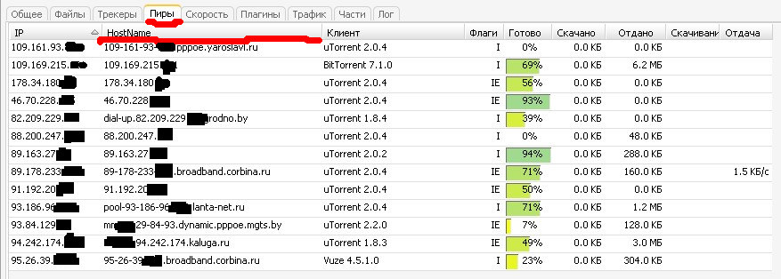

HostName Plugin for RUTorrent
==========================

The purpose of this plugin is to show hostnames of peers for selected torrent.
Based on GeoIP plugin.

Goals
-----
- async requests
- add hostname column instead of show hostnames in Address column

Usage
-----

Unpack the plugin archive into rutorrent/plugins directory and refresh
contents of your browser. If everything is OK, you should see a new
column "Host Name" in "Peers" tab.

Settings
--------

[init.js]

g_cache_size = 1024; /* Max count of cache items. */

Change log
----------

1.0 (03.10.2010)
- First release

3.9 (05.08.2019)
- Total refactoring

Contact
-------

Please send error reports and patches to: rozhuk.im@gmail.com
